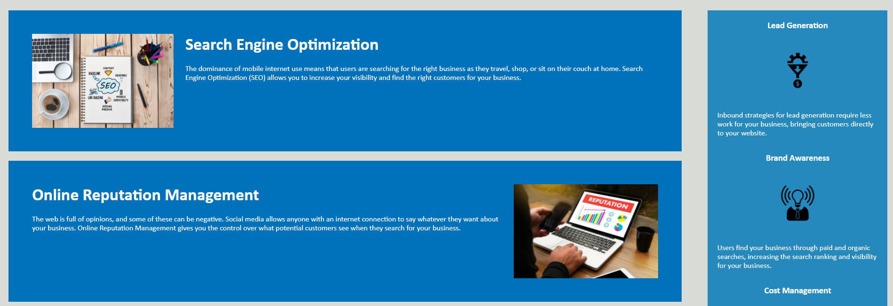

# Horiseon Home Page

## Purpose

The Purpose of this project was to refactor the home page for Horiseon Social Solution Services to be more optimized for search engines.

The site can be found at: https://jpolmon.github.io/HoriseonHW01/

---
## Appearance

When visited the site should appear as:  

---

## Change Log

- Date: 07/29/2021 -- Author of Changes: J.P.O.

    - Changes to HTML  
        1. Moved the main section to be above the aside section.
	    2. Fixed the SEO button not being linked to the section below it. 
	    3. Updated the HTML tags to be more descriptive. 
	    4. Added comments for clarity. 
	    5. Added image alt tags.
	    6. Gave the website a tab title when opened in a browser.
    
   
&nbsp;

    
    - Changes to CSS
    	1. Removed the ul style type of none because that is the default value.
	    2. Removed the p styling because 16 is the default font size.
	    3. Removed the a styling as it is already defined in the header.
	    4. Re-named the tags to fit the new convention of the HTML file.
	    5. Consolidated the section, h2, and image styles for main.
	    6. Consolidated the section, h3, and image styles for aside.
	    7. Added comments for clarity.

